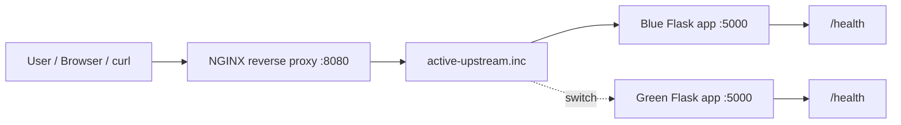

# Blue-Green Deployment Demo

A portfolio-ready DevOps project that demonstrates zero-downtime deployment using two Flask app versions, Docker Compose, NGINX reverse proxy traffic switching, and GitHub Actions validation.

Blue-green deployment keeps two production-like environments available:

- **Blue**: current stable version.
- **Green**: new candidate version.

Traffic is switched at the proxy layer only after the target version is healthy. If something goes wrong, traffic can roll back to the previous color quickly.

## Architecture



## Folder Structure

```text
blue-green-deployment-demo/
├── .github/workflows/ci.yml
├── app/
│   ├── __init__.py
│   └── main.py
├── nginx/
│   ├── active-upstream.inc
│   ├── blue-upstream.conf
│   ├── default.conf
│   └── green-upstream.conf
├── scripts/
│   ├── deploy-blue.sh
│   ├── deploy-green.sh
│   ├── rollback.sh
│   ├── switch-to-blue.sh
│   └── switch-to-green.sh
├── tests/test_app.py
├── Dockerfile
├── compose.yaml
├── requirements-dev.txt
└── requirements.txt
```

## Endpoints

| Endpoint | Purpose |
| --- | --- |
| `/` | Shows active app color and version |
| `/health` | Healthcheck for Docker, Compose, and deployment scripts |
| `/version` | Returns app color, version, hostname, and timestamp |

## Prerequisites

- Docker 24 or newer
- Docker Compose v2
- Python 3.12 or newer, only for local tests outside Docker

## Run Locally

Start the full stack:

```sh
docker compose up --build -d
```

Open the app:

```text
http://localhost:8080
```

Check which color is active:

```sh
curl http://localhost:8080/version
```

By default, NGINX routes traffic to **blue**.

## Switch Traffic

Switch to green:

```sh
./scripts/switch-to-green.sh
curl http://localhost:8080/version
```

Switch back to blue:

```sh
./scripts/switch-to-blue.sh
curl http://localhost:8080/version
```

The switch scripts:

1. Check the target app health endpoint.
2. Update `nginx/active-upstream.inc`.
3. Reload NGINX without stopping the container.
4. Record the previous active color for rollback.

## Deployment Flow

Deploy blue:

```sh
./scripts/deploy-blue.sh
```

Deploy green:

```sh
./scripts/deploy-green.sh
```

Typical blue-green workflow:

1. Run blue as the stable version.
2. Deploy green with new code.
3. Check green health.
4. Switch traffic to green.
5. Monitor behavior.
6. Roll back to blue if needed.

## Rollback Demo

After switching traffic, roll back to the previous color:

```sh
./scripts/rollback.sh
curl http://localhost:8080/version
```

Example:

```sh
./scripts/switch-to-green.sh
./scripts/rollback.sh
```

If green was active, rollback switches traffic back to blue. If blue was active, rollback switches traffic back to green.

## Run Tests Locally

```sh
python -m venv .venv
source .venv/bin/activate
pip install -r requirements.txt -r requirements-dev.txt
pytest -q
```

## Validate Configs Locally

Validate Docker Compose:

```sh
docker compose config --quiet
```

Validate NGINX config:

```sh
docker run --rm \
  -v "$PWD/nginx:/etc/nginx/conf.d:ro" \
  nginx:1.27-alpine \
  nginx -t
```

## GitHub Actions

The CI workflow validates:

- Flask route tests with pytest.
- Docker Compose syntax.
- NGINX configuration syntax.
- Docker image builds for blue and green services.

## NGINX Security Features

- `server_tokens off` hides NGINX version details.
- Security headers reduce browser-side risk.
- Rate limiting protects the demo from accidental request bursts.
- Proxy headers preserve original host and client information.

## Troubleshooting

### Port 8080 is already in use

Change the host port in `compose.yaml`:

```yaml
ports:
  - "8081:80"
```

Then open `http://localhost:8081`.

### Switch script says target is unhealthy

Check service status:

```sh
docker compose ps
docker compose logs green
docker compose logs blue
```

### NGINX does not reflect the switch

Reload NGINX manually:

```sh
docker compose exec nginx nginx -s reload
```

Then check:

```sh
curl http://localhost:8080/version
```

### Docker daemon is not running

Start Docker Desktop, then run:

```sh
docker version
docker compose up --build -d
```

## Resume Bullet Points

- Built a blue-green deployment demo using Flask, Docker Compose, and NGINX reverse proxy traffic switching.
- Implemented health-gated deployment scripts for blue, green, switch, and rollback workflows.
- Configured NGINX with security headers, rate limiting, hidden server tokens, and zero-downtime reloads.
- Added GitHub Actions validation for unit tests, Docker Compose syntax, NGINX syntax, and Docker image builds.
- Documented deployment, rollback, troubleshooting, and operational flow for a portfolio-ready DevOps project.

## Cleanup

```sh
docker compose down
```
